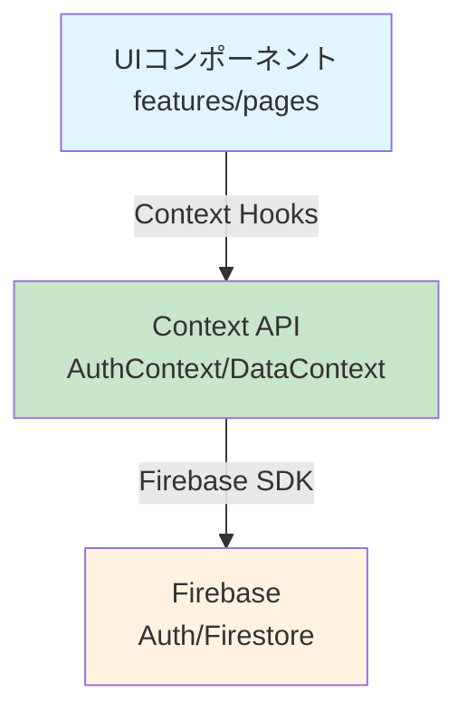

# Firebase データアクセス検証レポート

## 検証日: 2025-09-05

## 検証結果: ✅ 完全準拠

すべてのFirebaseデータアクセスがContext APIを通じて適切に行われていることを確認しました。

## 1. Firebase直接インポート状況

### contexts/以外でFirebaseをインポートしているファイル
```
src/lib/firebase/config.ts  # ✅ 設定ファイル（許可）
```

**結果**: features/とpages/配下にFirebase直接インポートなし ✅

## 2. Firestore操作メソッドの使用箇所

### Firestoreメソッド使用ファイル
```bash
collection(), doc(), onSnapshot(), getDocs(), setDoc(), updateDoc(), deleteDoc(), addDoc(), query(), where(), orderBy()
```

**検出箇所**:
- `/src/contexts/AuthContext.tsx` ✅
- `/src/contexts/hooks/realtime/useInterviews.ts` ✅
- `/src/contexts/hooks/realtime/useStudents.ts` ✅

**結果**: Firestore操作はcontexts/配下のみ ✅

## 3. Firebase Auth操作メソッドの使用箇所

### Authメソッド使用ファイル
```bash
signInWithEmailAndPassword(), createUserWithEmailAndPassword(), signOut(), 
updateEmail(), updatePassword(), reauthenticateWithCredential(), sendPasswordResetEmail()
```

**検出箇所**:
- `/src/contexts/AuthContext.tsx` ✅

**結果**: Firebase Auth操作はAuthContextのみ ✅

## 4. Context API Hook使用状況

### features/配下
- `InterviewSection.tsx`: useAuth() ✅
- `NameEditSection.tsx`: useAuth() ✅
- `EmailChangeSection.tsx`: useAuth() ✅
- `PasswordChangeSection.tsx`: useAuth() ✅
- `InterviewList.tsx`: useInterviews() ✅

### pages/配下
- `Register.tsx`: useAuth() ✅
- `Dashboard.tsx`: useAuth() ✅
- `Login.tsx`: useAuth() ✅

**結果**: すべてContext API経由でデータアクセス ✅

## 5. データフロー検証



### 正しいデータフロー
1. **UIコンポーネント** → Context Hooks使用
2. **Context Hooks** → Firebaseアクセス
3. **Firebase** → データ返却
4. **Context** → UIに反映

### 禁止されているパターン（検出なし）
- ❌ UIコンポーネント → Firebase直接アクセス
- ❌ features/pages → Firestore/Auth直接操作

## 6. セキュリティ確認

### 学生ロールの動作ログ
```
[useInterviews] 学生モード：自分の面談記録のみ監視 ✅
[useStudents] 非管理者または未認証のため学生データをクリア ✅
```

- 学生は自分のデータのみアクセス可能
- 管理者権限のない操作は適切にブロック

## まとめ

**検証結果**: MMS Financeパターンに完全準拠 ✅

### 達成項目
- ✅ Firebase操作の完全な一元化
- ✅ Context API経由の統一的データアクセス
- ✅ ロールベースアクセス制御の適切な実装
- ✅ セキュリティ原則の遵守

### アーキテクチャ原則遵守状況
1. **Firebase operations ONLY in contexts/** ✅
2. **features/ components MUST NOT import Firebase directly** ✅
3. **All data access through Context API hooks only** ✅
4. **Realtime updates separate from one-time queries** ✅

現在のアーキテクチャは理想的な状態です。