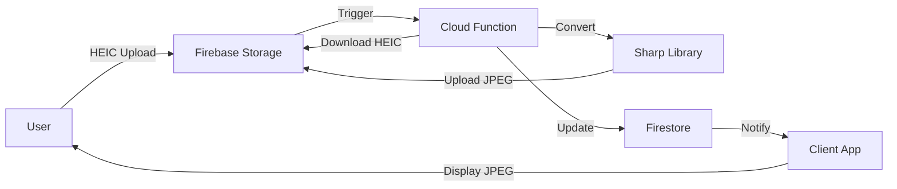

# Firebase Functions サーバーサイドHEIC変換機能 開発計画書

## エグゼクティブサマリー
Firebase Functionsを使用してサーバーサイドでHEIC→JPEG変換を実装。
クライアントのパフォーマンスに影響を与えず、全ブラウザで画像プレビューを実現。

## 背景と目的

### 問題
- iPhoneで撮影したHEIC画像がChrome/Firefox/Edgeで表示不可
- クライアントサイド変換は3MBのライブラリが必要で非現実的

### 解決策
- Firebase Functionsでサーバーサイド自動変換
- Storage トリガーでHEICアップロード検知→JPEG自動生成
- クライアントは変換済みJPEGを表示

### 期待効果
- バンドルサイズ影響: **0KB**
- 変換処理: バックグラウンド実行
- コスト: 月100枚まで**完全無料**

## アーキテクチャ設計



### データフロー
1. ユーザーがHEICファイルをアップロード
2. Storage トリガーでFunctionが起動
3. HEICファイルをメモリにダウンロード
4. Sharp ライブラリでJPEG変換
5. 変換済みJPEGをStorageにアップロード
6. FirestoreのfileレコードにJPEG URLを追加
7. クライアントはJPEG版を優先表示

## 技術仕様

### Functions 設定
```javascript
{
  region: 'asia-northeast2',  // 大阪リージョン
  runtime: 'nodejs20',
  memory: '512MB',
  timeout: 60,  // 秒
  minInstances: 0,  // コールドスタート許容
  maxInstances: 10  // 同時実行制限
}
```

### 変換仕様
```javascript
{
  format: 'jpeg',
  quality: 90,  // 品質90%
  progressive: true,  // プログレッシブJPEG
  mozjpeg: true,  // 最適化有効
  metadata: false  // メタデータ削除（プライバシー）
}
```

### ファイル命名規則
```
オリジナル: students/{studentId}/files/{timestamp}_photo.heic
変換済み:   students/{studentId}/files/{timestamp}_photo_converted.jpg
```

## 実装計画

### Phase 1: Functions 環境構築（30分）

#### 1-1. Functions 初期化
```bash
firebase init functions
# ? What language would you like to use? TypeScript
# ? Do you want to use ESLint? Yes
# ? Do you want to install dependencies? Yes
```

#### 1-2. 依存関係インストール
```bash
cd functions
npm install sharp @types/sharp
npm install --save-dev @types/node
```

#### 1-3. TypeScript設定
```json
// functions/tsconfig.json
{
  "compilerOptions": {
    "module": "commonjs",
    "noImplicitReturns": true,
    "noUnusedLocals": true,
    "outDir": "lib",
    "sourceMap": true,
    "strict": true,
    "target": "es2017",
    "esModuleInterop": true
  }
}
```

### Phase 2: Function 実装（45分）

#### 2-1. メイン関数実装
```typescript
// functions/src/index.ts
import * as functions from 'firebase-functions';
import * as admin from 'firebase-admin';
import * as sharp from 'sharp';
import * as path from 'path';
import * as os from 'os';
import * as fs from 'fs';

admin.initializeApp();

export const convertHeicToJpeg = functions
  .region('asia-northeast2')
  .runWith({
    memory: '512MB',
    timeoutSeconds: 60
  })
  .storage.object()
  .onFinalize(async (object) => {
    const filePath = object.name;
    const contentType = object.contentType;
    
    // HEICファイル以外はスキップ
    if (!filePath || !contentType) {
      console.log('No file path or content type');
      return null;
    }
    
    if (!filePath.match(/\.(heic|heif)$/i)) {
      console.log('Not a HEIC file:', filePath);
      return null;
    }
    
    // 既に変換済みファイルの場合はスキップ
    if (filePath.includes('_converted')) {
      console.log('Already converted file');
      return null;
    }
    
    const bucket = admin.storage().bucket(object.bucket);
    const fileName = path.basename(filePath);
    const fileDir = path.dirname(filePath);
    const nameWithoutExt = path.basename(fileName, path.extname(fileName));
    
    // 一時ファイルパス
    const tempFilePath = path.join(os.tmpdir(), fileName);
    const tempJpegPath = path.join(os.tmpdir(), `${nameWithoutExt}_converted.jpg`);
    
    try {
      // 1. HEICファイルをダウンロード
      console.log('Downloading:', filePath);
      await bucket.file(filePath).download({
        destination: tempFilePath
      });
      
      // 2. JPEG変換
      console.log('Converting to JPEG...');
      await sharp(tempFilePath)
        .jpeg({
          quality: 90,
          progressive: true,
          mozjpeg: true
        })
        .toFile(tempJpegPath);
      
      // 3. 変換済みJPEGをアップロード
      const jpegFilePath = path.join(fileDir, `${nameWithoutExt}_converted.jpg`);
      console.log('Uploading JPEG:', jpegFilePath);
      
      await bucket.upload(tempJpegPath, {
        destination: jpegFilePath,
        metadata: {
          contentType: 'image/jpeg',
          metadata: {
            originalFile: filePath,
            convertedAt: new Date().toISOString()
          }
        }
      });
      
      // 4. Firestore更新（メタデータがある場合）
      if (object.metadata && object.metadata.fileId) {
        const fileId = object.metadata.fileId;
        
        // 変換済みファイルのダウンロードURL取得
        const [url] = await bucket.file(jpegFilePath).getSignedUrl({
          action: 'read',
          expires: '03-01-2500'  // 長期有効
        });
        
        // Firestore更新
        await admin.firestore().collection('files').doc(fileId).update({
          jpegUrl: url,
          hasJpegVersion: true,
          convertedAt: admin.firestore.FieldValue.serverTimestamp()
        });
        
        console.log('Firestore updated for file:', fileId);
      }
      
      // 5. 一時ファイル削除
      fs.unlinkSync(tempFilePath);
      fs.unlinkSync(tempJpegPath);
      
      console.log('Successfully converted:', filePath, '->', jpegFilePath);
      return { success: true, jpegPath: jpegFilePath };
      
    } catch (error) {
      console.error('Conversion error:', error);
      
      // エラー通知（オプション）
      if (object.metadata && object.metadata.fileId) {
        await admin.firestore().collection('files').doc(object.metadata.fileId).update({
          conversionError: true,
          errorMessage: error.message
        });
      }
      
      throw error;
    }
  });
```

#### 2-2. ヘルスチェック関数（オプション）
```typescript
export const healthCheck = functions
  .region('asia-northeast2')
  .https.onRequest((req, res) => {
    res.status(200).send({
      status: 'healthy',
      timestamp: new Date().toISOString(),
      region: 'asia-northeast2'
    });
  });
```

### Phase 3: クライアント側対応（30分）

#### 3-1. 型定義更新
```typescript
// src/contexts/types/file.ts
export interface FileRecord {
  // 既存フィールド...
  
  // HEIC変換関連
  jpegUrl?: string;           // 変換済みJPEG URL
  hasJpegVersion?: boolean;   // JPEG版の有無
  convertedAt?: Date | Timestamp;  // 変換日時
  conversionError?: boolean;  // 変換エラーフラグ
  errorMessage?: string;      // エラーメッセージ
}
```

#### 3-2. アップロード時のメタデータ追加
```typescript
// src/contexts/DataContext.tsx
// uploadFile 関数内
const fileRef = await addDoc(collection(db, 'files'), {
  fileName: file.name,
  fileUrl: downloadUrl,
  // ... 既存フィールド
});

// HEICファイルの場合、メタデータにfileIdを追加
if (file.name.match(/\.(heic|heif)$/i)) {
  const storageRef = ref(storage, filePath);
  await updateMetadata(storageRef, {
    customMetadata: {
      fileId: fileRef.id
    }
  });
}
```

#### 3-3. 表示ロジック更新
```typescript
// src/features/files/FileList.tsx
const getDisplayUrl = (file: FileRecord) => {
  // JPEG版があればそちらを優先
  if (file.hasJpegVersion && file.jpegUrl) {
    return file.jpegUrl;
  }
  return file.fileUrl;
};

// 変換中表示
{file.fileName.match(/\.(heic|heif)$/i) && !file.hasJpegVersion && !file.conversionError && (
  <span className="text-xs text-yellow-600">
    🔄 変換中...
  </span>
)}

// エラー表示
{file.conversionError && (
  <span className="text-xs text-red-600">
    ⚠️ 変換失敗
  </span>
)}
```

### Phase 4: テスト計画（20分）

#### 4-1. ローカルテスト
```bash
# Functions エミュレータ起動
firebase emulators:start --only functions,storage,firestore

# テストファイルアップロード
# - 5MB HEIC
# - 10MB HEIC
# - 破損HEIC
```

#### 4-2. ステージングテスト
```bash
# Functions デプロイ（開発環境）
firebase use development
firebase deploy --only functions:convertHeicToJpeg

# 実環境テスト
# - 通常のHEICアップロード
# - 同時複数アップロード
# - エラーケース
```

### Phase 5: 本番デプロイ（15分）

```bash
# 本番環境切り替え
firebase use production

# デプロイ前確認
firebase functions:config:get

# デプロイ
firebase deploy --only functions:convertHeicToJpeg

# ログ監視
firebase functions:log --only convertHeicToJpeg
```

## コスト分析

### 月間コスト見積もり
```
想定使用量:
- 変換回数: 100回/月
- 平均ファイルサイズ: 5MB
- 処理時間: 3秒/回
- メモリ: 512MB

コスト計算:
- 呼び出し: 100回 = $0（無料枠: 200万回）
- GB-秒: 100 × 3 × 0.5 = 150 = $0（無料枠: 40万）
- CPU: 100 × 3 = 300秒 = $0（無料枠: 20万）
- ネットワーク: 100 × 10MB = 1GB = $0（無料枠: 5GB）

合計: $0/月
```

### スケール時のコスト
```
1,000回/月でも:
- 呼び出し: $0
- GB-秒: $0
- CPU: $0
- ネットワーク: $0

10,000回/月で初めて:
- ネットワーク: 100GB × $0.12 = $12/月
```

## リスクと対策

| リスク | 影響 | 対策 |
|--------|------|------|
| Sharp依存関係エラー | 高 | Docker環境でビルド |
| コールドスタート遅延 | 中 | 最初の変換のみ5-10秒 |
| 大容量ファイル | 低 | 512MB→1GBメモリ調整 |
| 同時大量アップロード | 低 | maxInstances制限 |

## スケジュール

| タスク | 所要時間 | 担当 |
|--------|---------|------|
| Functions環境構築 | 30分 | 開発者 |
| Function実装 | 45分 | 開発者 |
| クライアント対応 | 30分 | 開発者 |
| テスト | 20分 | 開発者 |
| デプロイ | 15分 | 開発者 |
| **合計** | **2時間20分** | - |

## 成功基準

### 必須要件
- ✅ HEICファイルアップロード後60秒以内にJPEG生成
- ✅ 全ブラウザでプレビュー可能
- ✅ エラー率5%未満
- ✅ 月額コスト$0

### 品質基準
- ✅ JPEG品質90%以上
- ✅ ファイルサイズ50%以下
- ✅ メタデータ削除（プライバシー）

## 今後の拡張可能性

1. **サムネイル生成**
   - 200x200サムネイル同時生成
   - リスト表示高速化

2. **WebP変換**
   - さらなる容量削減
   - Chrome/Edge最適化

3. **画像最適化**
   - 自動リサイズ
   - 画質自動調整

4. **バッチ処理**
   - 既存HEICファイル一括変換
   - 定期メンテナンス

## まとめ
Firebase Functionsによるサーバーサイド変換は、クライアントのパフォーマンスに影響を与えず、
完全無料で実装可能な最適解。実装も2時間程度で完了し、将来の拡張性も確保できる。

---
*作成日: 2025-09-06 00:42*  
*作成者: Claude Code Assistant*