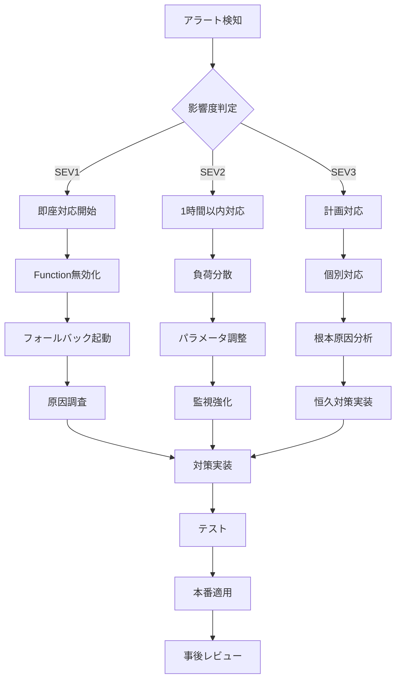

# Firebase Functions HEIC変換機能 運用マニュアル

*作成日時: 2025-09-06 00:42*  
*対象者: システム管理者・開発者*

## 目次
1. [日常運用](#日常運用)
2. [監視項目](#監視項目)
3. [緊急対応手順](#緊急対応手順)
4. [メンテナンス作業](#メンテナンス作業)
5. [コスト管理](#コスト管理)
6. [バックアップとリストア](#バックアップとリストア)
7. [スケーリング対応](#スケーリング対応)
8. [インシデント対応フロー](#インシデント対応フロー)

---

## 日常運用

### 毎日の確認事項（5分）

#### 朝の確認（9:00）
```bash
# 1. 夜間エラー確認
firebase functions:log --only convertHeicToJpeg --limit 20 | grep ERROR

# 2. 変換成功率確認
gcloud logging read "resource.type=cloud_function 
  AND resource.labels.function_name=convertHeicToJpeg 
  AND timestamp>=\"$(date -u -d '24 hours ago' '+%Y-%m-%dT%H:%M:%S')Z\"" \
  --format json | jq '.[] | select(.severity=="INFO")' | wc -l

# 3. コスト確認
gcloud billing accounts list
gcloud beta billing budgets list
```

#### 夕方の確認（17:00）
```bash
# 1. 本日の処理件数
firebase functions:log --only convertHeicToJpeg | grep "Successfully converted" | wc -l

# 2. 平均処理時間
gcloud logging read "resource.type=cloud_function 
  AND labels.execution_id!='' 
  AND timestamp>=\"$(date -u -d 'today 00:00' '+%Y-%m-%dT%H:%M:%S')Z\"" \
  --format json | jq '.[] | .labels.execution_time_ms' | awk '{sum+=$1} END {print sum/NR}'

# 3. ストレージ使用量
gsutil du -sh gs://mms-student-meeting.appspot.com/students/
```

### 週次タスク（月曜日 10:00）

#### 1. パフォーマンスレポート生成
```javascript
// functions/scripts/weeklyReport.js
const admin = require('firebase-admin');
admin.initializeApp();

async function generateWeeklyReport() {
  const oneWeekAgo = new Date(Date.now() - 7 * 24 * 60 * 60 * 1000);
  
  const metrics = await admin.firestore()
    .collection('conversion_metrics')
    .where('timestamp', '>=', oneWeekAgo)
    .get();
  
  const stats = {
    totalConversions: metrics.size,
    averageProcessingTime: 0,
    totalDataProcessed: 0,
    failureRate: 0,
    averageCompressionRatio: 0
  };
  
  metrics.forEach(doc => {
    const data = doc.data();
    stats.averageProcessingTime += data.processingTime;
    stats.totalDataProcessed += data.originalSize;
    stats.averageCompressionRatio += data.compressionRatio;
  });
  
  stats.averageProcessingTime /= metrics.size;
  stats.averageCompressionRatio /= metrics.size;
  
  console.log('Weekly Report:', stats);
  
  // Slackに通知（オプション）
  await sendSlackNotification(stats);
}

generateWeeklyReport();
```

#### 2. ストレージクリーンアップ
```bash
# 30日以上前の変換済みファイルを削除（オプション）
gsutil -m rm -r gs://mms-student-meeting.appspot.com/students/*/*/*_converted.jpg \
  -x "*.heic" \
  -x "*.HEIC" \
  $(find . -type f -mtime +30)
```

### 月次タスク（月初）

#### 1. コスト分析
```python
# scripts/cost_analysis.py
from google.cloud import billing_v1
import pandas as pd
from datetime import datetime, timedelta

def analyze_monthly_cost():
    client = billing_v1.CloudBillingClient()
    
    # 前月のコスト取得
    end_date = datetime.now().replace(day=1) - timedelta(days=1)
    start_date = end_date.replace(day=1)
    
    costs = client.list_project_billing_info(
        name=f"projects/mms-student-meeting",
        start_date=start_date.isoformat(),
        end_date=end_date.isoformat()
    )
    
    # Functions関連のコスト抽出
    functions_cost = sum([
        c.cost for c in costs 
        if 'Cloud Functions' in c.service
    ])
    
    print(f"月間Functions費用: ${functions_cost:.2f}")
    
    # 変換1件あたりのコスト計算
    total_conversions = get_monthly_conversions()
    cost_per_conversion = functions_cost / total_conversions if total_conversions > 0 else 0
    
    print(f"変換1件あたり: ${cost_per_conversion:.4f}")
    
    return {
        'total_cost': functions_cost,
        'conversions': total_conversions,
        'cost_per_conversion': cost_per_conversion
    }
```

---

## 監視項目

### リアルタイム監視ダッシュボード

#### Google Cloud Console設定
```yaml
# monitoring-dashboard.yaml
displayName: HEIC Conversion Monitor
mosaicLayout:
  columns: 12
  tiles:
    - width: 6
      height: 4
      widget:
        title: Conversion Rate
        xyChart:
          dataSets:
            - timeSeriesQuery:
                timeSeriesFilter:
                  filter: |
                    resource.type="cloud_function"
                    resource.labels.function_name="convertHeicToJpeg"
                    metric.type="cloudfunctions.googleapis.com/function/execution_count"
    
    - width: 6
      height: 4
      widget:
        title: Error Rate
        xyChart:
          dataSets:
            - timeSeriesQuery:
                timeSeriesFilter:
                  filter: |
                    resource.type="cloud_function"
                    resource.labels.function_name="convertHeicToJpeg"
                    metric.labels.status!="ok"
    
    - width: 6
      height: 4
      widget:
        title: Average Latency
        xyChart:
          dataSets:
            - timeSeriesQuery:
                timeSeriesFilter:
                  filter: |
                    resource.type="cloud_function"
                    metric.type="cloudfunctions.googleapis.com/function/execution_times"
    
    - width: 6
      height: 4
      widget:
        title: Memory Usage
        xyChart:
          dataSets:
            - timeSeriesQuery:
                timeSeriesFilter:
                  filter: |
                    resource.type="cloud_function"
                    metric.type="cloudfunctions.googleapis.com/function/user_memory_bytes"
```

### アラート設定

#### 重要度: 緊急（P1）
```javascript
// 5分間で10回以上のエラー
{
  alertPolicy: {
    displayName: "HEIC Conversion Critical Errors",
    conditions: [{
      displayName: "Error rate too high",
      conditionThreshold: {
        filter: 'resource.type="cloud_function" AND metric.labels.status!="ok"',
        comparison: "COMPARISON_GT",
        thresholdValue: 10,
        duration: "300s"
      }
    }],
    notificationChannels: ["projects/PROJECT_ID/notificationChannels/CHANNEL_ID"],
    alertStrategy: {
      autoClose: "604800s" // 7 days
    }
  }
}
```

#### 重要度: 警告（P2）
```javascript
// 処理時間が30秒を超える
{
  alertPolicy: {
    displayName: "HEIC Conversion Slow",
    conditions: [{
      displayName: "Processing too slow",
      conditionThreshold: {
        filter: 'resource.type="cloud_function" AND metric.type="cloudfunctions.googleapis.com/function/execution_times"',
        comparison: "COMPARISON_GT",
        thresholdValue: 30000, // milliseconds
        duration: "180s"
      }
    }]
  }
}
```

---

## 緊急対応手順

### レベル1: 軽微な問題（変換失敗率 < 5%）

#### 対応手順
1. **ログ確認**（5分）
```bash
firebase functions:log --only convertHeicToJpeg --limit 50 | grep ERROR
```

2. **個別リトライ**（10分）
```javascript
// scripts/retry_failed.js
const failedFiles = await admin.firestore()
  .collection('files')
  .where('conversionError', '==', true)
  .where('retryCount', '<', 3)
  .get();

for (const doc of failedFiles.docs) {
  await retryConversion(doc.id);
}
```

3. **ユーザー通知**（必要に応じて）
```javascript
// 影響を受けたユーザーにメール通知
await sendNotificationToAffectedUsers(failedFiles);
```

### レベル2: 中程度の問題（変換失敗率 5-20%）

#### 対応手順
1. **Function再起動**（2分）
```bash
# 一時的に無効化
gcloud functions delete convertHeicToJpeg --region=asia-northeast2 --quiet

# 再デプロイ
firebase deploy --only functions:convertHeicToJpeg
```

2. **メモリ増加**（5分）
```javascript
// functions/src/index.ts
.runWith({
  memory: '1GB',  // 512MB → 1GB
  timeoutSeconds: 120  // 60 → 120
})
```

3. **負荷分散**（10分）
```bash
# インスタンス数増加
gcloud functions deploy convertHeicToJpeg \
  --max-instances=20 \
  --region=asia-northeast2
```

### レベル3: 重大な問題（変換失敗率 > 20%）

#### 即座の対応（5分以内）
1. **Function無効化**
```bash
gcloud functions delete convertHeicToJpeg --region=asia-northeast2 --quiet
```

2. **フォールバック起動**
```javascript
// クライアント側でHEIC警告表示に切り替え
await admin.firestore().collection('config').doc('features').update({
  heicConversionEnabled: false
});
```

3. **ステークホルダー通知**
```bash
# Slack緊急通知
curl -X POST -H 'Content-type: application/json' \
  --data '{"text":"🚨 HEIC変換機能に障害発生。対応中です。"}' \
  YOUR_SLACK_WEBHOOK_URL
```

#### 根本対応（30分以内）
1. **原因調査**
```bash
# エラーパターン分析
gcloud logging read "severity=ERROR" --limit 100 --format json \
  | jq '.[] | {error: .textPayload, time: .timestamp}' \
  | sort | uniq -c
```

2. **ロールバック判断**
```bash
# 前バージョンの確認
gcloud functions describe convertHeicToJpeg --region=asia-northeast2 \
  --format="value(sourceArchiveUrl)"

# ロールバック実行
firebase functions:delete convertHeicToJpeg
git checkout HEAD~1 -- functions/
firebase deploy --only functions:convertHeicToJpeg
```

---

## メンテナンス作業

### 定期メンテナンス（月1回）

#### 1. 依存関係更新
```bash
cd functions
npm outdated
npm update --save
npm audit fix

# Sharp特別対応
npm rebuild sharp --platform=linux --arch=x64
```

#### 2. セキュリティパッチ
```bash
# 脆弱性確認
npm audit

# 自動修正
npm audit fix

# 強制修正（breaking changes含む）
npm audit fix --force
```

#### 3. パフォーマンステスト
```javascript
// functions/test/performance.test.js
const loadTest = require('loadtest');

const options = {
  url: 'https://asia-northeast2-mms-student-meeting.cloudfunctions.net/healthCheck',
  concurrent: 10,
  method: 'GET',
  requestsPerSecond: 5,
  maxSeconds: 60
};

loadTest.loadTest(options, (error, result) => {
  if (error) {
    console.error('Load test failed:', error);
    return;
  }
  
  console.log('Performance test results:');
  console.log('- Total requests:', result.totalRequests);
  console.log('- RPS:', result.rps);
  console.log('- Mean latency:', result.meanLatency);
  console.log('- 99% latency:', result.percentiles['99']);
  
  // 基準値チェック
  if (result.meanLatency > 1000) {
    console.warn('⚠️ Mean latency exceeds 1s threshold');
  }
});
```

### 計画メンテナンス手順

#### 事前準備（1週間前）
1. **メンテナンス告知**
```javascript
// Firestoreに告知設定
await admin.firestore().collection('announcements').add({
  type: 'maintenance',
  title: 'HEIC変換機能メンテナンスのお知らせ',
  message: '〇月〇日 2:00-4:00 にメンテナンスを実施します',
  startTime: new Date('2025-09-13T02:00:00'),
  endTime: new Date('2025-09-13T04:00:00'),
  createdAt: admin.firestore.FieldValue.serverTimestamp()
});
```

2. **バックアップ取得**
```bash
# Functionコードバックアップ
tar -czf functions_backup_$(date +%Y%m%d).tar.gz functions/

# 設定バックアップ
firebase functions:config:get > functions_config_backup.json
```

#### メンテナンス実施
1. **メンテナンスモード開始**
```javascript
// functions/maintenance.js
await admin.firestore().collection('config').doc('maintenance').set({
  enabled: true,
  message: 'システムメンテナンス中です',
  estimatedEndTime: new Date('2025-09-13T04:00:00')
});
```

2. **作業実施**
```bash
# Function停止
gcloud functions delete convertHeicToJpeg --region=asia-northeast2

# 更新作業
cd functions
npm install [updates]
npm run build

# デプロイ
firebase deploy --only functions:convertHeicToJpeg
```

3. **動作確認**
```bash
# ヘルスチェック
curl https://asia-northeast2-mms-student-meeting.cloudfunctions.net/healthCheck

# テスト変換実行
gsutil cp test_file.heic gs://mms-student-meeting.appspot.com/test/
```

4. **メンテナンスモード解除**
```javascript
await admin.firestore().collection('config').doc('maintenance').update({
  enabled: false
});
```

---

## コスト管理

### 月次予算設定
```yaml
# budget.yaml
billingAccount: billingAccounts/YOUR_BILLING_ACCOUNT_ID
displayName: MMS Functions Budget
budgetFilter:
  projects:
    - projects/mms-student-meeting
  services:
    - services/24E6-581D-38E5  # Cloud Functions
amount:
  specifiedAmount:
    currencyCode: JPY
    units: 1000  # ¥1,000
thresholdRules:
  - thresholdPercent: 0.5
    spendBasis: CURRENT_SPEND
  - thresholdPercent: 0.9
    spendBasis: CURRENT_SPEND
  - thresholdPercent: 1.0
    spendBasis: CURRENT_SPEND
notificationsRule:
  disableDefaultIamRecipients: false
  monitoringNotificationChannels:
    - projects/PROJECT_ID/notificationChannels/CHANNEL_ID
```

### コスト削減施策

#### 1. インスタンス最適化
```javascript
// ピーク時間帯のみインスタンス増加
const hour = new Date().getHours();
const isBusinessHours = hour >= 9 && hour <= 18;

exports.convertHeicToJpeg = functions
  .runWith({
    minInstances: isBusinessHours ? 1 : 0,
    maxInstances: isBusinessHours ? 10 : 3
  })
```

#### 2. キャッシュ活用
```javascript
// 同一ファイルの重複変換防止
const conversionCache = new Map();

async function checkCache(fileHash: string): Promise<string | null> {
  if (conversionCache.has(fileHash)) {
    return conversionCache.get(fileHash);
  }
  
  // Firestoreキャッシュ確認
  const cached = await admin.firestore()
    .collection('conversion_cache')
    .doc(fileHash)
    .get();
  
  if (cached.exists) {
    return cached.data().jpegUrl;
  }
  
  return null;
}
```

---

## バックアップとリストア

### 自動バックアップ設定

#### 日次バックアップ（Cloud Scheduler）
```yaml
# backup-schedule.yaml
name: projects/PROJECT_ID/locations/asia-northeast2/jobs/daily-function-backup
schedule: "0 2 * * *"  # 毎日2:00 AM
timeZone: "Asia/Tokyo"
httpTarget:
  uri: https://asia-northeast2-mms-student-meeting.cloudfunctions.net/backupFunctions
  httpMethod: POST
  oidcToken:
    serviceAccountEmail: PROJECT_ID@appspot.gserviceaccount.com
```

#### バックアップFunction
```javascript
exports.backupFunctions = functions.pubsub.schedule('0 2 * * *')
  .timeZone('Asia/Tokyo')
  .onRun(async (context) => {
    const timestamp = new Date().toISOString().split('T')[0];
    
    // Functionコード取得
    const functionCode = await getFunctionSourceCode('convertHeicToJpeg');
    
    // Cloud Storageに保存
    const bucket = admin.storage().bucket();
    const file = bucket.file(`backups/functions/${timestamp}/convertHeicToJpeg.zip`);
    
    await file.save(functionCode, {
      metadata: {
        contentType: 'application/zip',
        metadata: {
          backupDate: timestamp,
          functionName: 'convertHeicToJpeg',
          version: process.env.K_REVISION
        }
      }
    });
    
    console.log(`Backup completed: ${timestamp}`);
    
    // 古いバックアップ削除（30日以上前）
    await cleanOldBackups();
});
```

### リストア手順

#### 1. バックアップ一覧確認
```bash
gsutil ls -l gs://mms-student-meeting.appspot.com/backups/functions/
```

#### 2. バックアップ取得
```bash
# 特定日付のバックアップ取得
gsutil cp gs://mms-student-meeting.appspot.com/backups/functions/2025-09-06/convertHeicToJpeg.zip .

# 展開
unzip convertHeicToJpeg.zip -d functions_restore/
```

#### 3. リストア実行
```bash
# 現在のFunctionバックアップ
cp -r functions/ functions_current_backup/

# リストア
cp -r functions_restore/* functions/

# デプロイ
firebase deploy --only functions:convertHeicToJpeg
```

#### 4. 動作確認
```bash
# ログ確認
firebase functions:log --only convertHeicToJpeg

# テスト実行
curl -X POST https://asia-northeast2-mms-student-meeting.cloudfunctions.net/testConversion
```

---

## スケーリング対応

### 自動スケーリング設定

#### 負荷に応じた動的設定
```javascript
// functions/src/autoscale.ts
import { CloudFunctionsServiceClient } from '@google-cloud/functions';

const client = new CloudFunctionsServiceClient();

export async function adjustScaling() {
  const metrics = await getLastHourMetrics();
  
  let config = {
    minInstances: 0,
    maxInstances: 10,
    memory: '512MB'
  };
  
  // 高負荷時
  if (metrics.requestsPerMinute > 100) {
    config = {
      minInstances: 2,
      maxInstances: 50,
      memory: '1GB'
    };
  }
  // 中負荷時
  else if (metrics.requestsPerMinute > 30) {
    config = {
      minInstances: 1,
      maxInstances: 20,
      memory: '512MB'
    };
  }
  
  await updateFunctionConfig('convertHeicToJpeg', config);
}

// Cloud Schedulerで1時間ごとに実行
exports.autoScale = functions.pubsub.schedule('0 * * * *')
  .onRun(async () => {
    await adjustScaling();
  });
```

### 手動スケーリング

#### スケールアップ
```bash
# 緊急時の即座スケールアップ
gcloud functions deploy convertHeicToJpeg \
  --region=asia-northeast2 \
  --min-instances=5 \
  --max-instances=100 \
  --memory=2GB \
  --timeout=300s
```

#### スケールダウン
```bash
# 夜間・休日のスケールダウン
gcloud functions deploy convertHeicToJpeg \
  --region=asia-northeast2 \
  --min-instances=0 \
  --max-instances=5 \
  --memory=256MB \
  --timeout=60s
```

---

## インシデント対応フロー

### インシデント分類

#### SEV1: サービス停止
- **定義**: 変換機能が完全停止
- **対応時間**: 15分以内
- **通知**: 全ステークホルダー

#### SEV2: 機能劣化
- **定義**: 変換成功率50%以下
- **対応時間**: 1時間以内
- **通知**: 技術チーム

#### SEV3: 部分的問題
- **定義**: 特定ファイルのみ失敗
- **対応時間**: 24時間以内
- **通知**: 担当者

### 対応フローチャート


### インシデント記録テンプレート
```markdown
## インシデント番号: INC-YYYYMMDD-XXX

### 概要
- **発生日時**: 2025-09-06 HH:MM
- **検知方法**: [アラート/ユーザー報告/定期監視]
- **影響範囲**: [全体/一部/特定機能]
- **重要度**: SEV[1/2/3]

### タイムライン
- HH:MM - インシデント検知
- HH:MM - 初動対応開始
- HH:MM - 原因特定
- HH:MM - 対策実施
- HH:MM - 復旧確認
- HH:MM - インシデント終了

### 原因
[根本原因の詳細記載]

### 対応内容
1. [実施した対応1]
2. [実施した対応2]
3. [実施した対応3]

### 再発防止策
1. [短期対策]
2. [中期対策]
3. [長期対策]

### 学んだこと
- [教訓1]
- [教訓2]
- [教訓3]

### 関係者
- **対応者**: [名前]
- **承認者**: [名前]
- **影響ユーザー数**: [数値]
```

---

*最終更新: 2025-09-06 00:42*  
*作成者: Claude Code Assistant*