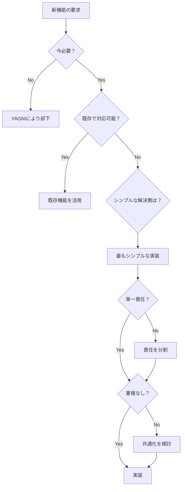

# 開発原則ガイドライン

**作成日**: 2025-09-05  
**バージョン**: 1.0.0  
**プロジェクト**: Learning Management System (LMS)

## 1. 基本理念

### 1.1 Core Beliefs
```
価値ある動くソフトウェア > 完璧な設計図
小さな改善の積み重ね    > 大規模な一括変更  
実践的な解決策          > 理論的な完璧さ
明確で読みやすいコード  > 賢くて複雑なコード
```

### 1.2 開発の心構え
- **3回失敗したら立ち止まって再考する**
- **動作するコードを段階的にコミット**
- **既存の実装から学んでから新規実装**
- **仮定せず、既存コードで検証**

## 2. SOLID原則

### 2.1 Single Responsibility Principle (単一責任の原則)
**「クラスを変更する理由は1つだけであるべき」**

❌ **悪い例**: 複数の責任を持つコンポーネント
```typescript
// 認証、データ取得、表示を全て担当
const StudentDashboard = () => {
  const [user, setUser] = useState(null);
  const [grades, setGrades] = useState([]);
  const [reports, setReports] = useState([]);
  
  // 認証処理
  useEffect(() => {
    firebase.auth().onAuthStateChanged(setUser);
  }, []);
  
  // データ取得
  useEffect(() => {
    if (user) {
      fetchGrades(user.id).then(setGrades);
      fetchReports(user.id).then(setReports);
    }
  }, [user]);
  
  // グラフ計算
  const calculateAverage = () => { /* ... */ };
  
  // レンダリング
  return <div>...</div>;
};
```

✅ **良い例**: 責任を分離
```typescript
// 認証はContext
const useAuth = () => useContext(AuthContext);

// データ取得はカスタムフック
const useStudentData = (studentId: string) => {
  const grades = useGrades(studentId);
  const reports = useReports(studentId);
  return { grades, reports };
};

// 表示のみに専念
const StudentDashboard = () => {
  const { user } = useAuth();
  const { grades, reports } = useStudentData(user?.id);
  return <DashboardView grades={grades} reports={reports} />;
};
```

### 2.2 Open/Closed Principle (開放閉鎖の原則)
**「拡張に対して開いており、修正に対して閉じている」**

✅ **良い例**: 新機能追加時に既存コードを変更しない
```typescript
// ベース通知インターフェース
interface Notification {
  send(message: string, user: User): Promise<void>;
}

// 実装を追加しても既存コードは変更不要
class EmailNotification implements Notification { /* ... */ }
class PushNotification implements Notification { /* ... */ }
class SMSNotification implements Notification { /* ... */ } // 新規追加

// 使用側も変更不要
const notificationService = new NotificationService([
  new EmailNotification(),
  new PushNotification(),
  new SMSNotification(), // 追加のみ
]);
```

### 2.3 Liskov Substitution Principle (リスコフの置換原則)
**「派生クラスは基底クラスと置換可能であるべき」**

✅ **良い例**: 予期しない動作をしない継承
```typescript
abstract class BaseReport {
  abstract generate(): Promise<ReportData>;
  abstract validate(): boolean;
}

// どの実装も同じインターフェースで動作
class DailyReport extends BaseReport { /* ... */ }
class WeeklyReport extends BaseReport { /* ... */ }
class MonthlyReport extends BaseReport { /* ... */ }

// 使用側は具体的な型を知る必要がない
const processReport = async (report: BaseReport) => {
  if (report.validate()) {
    const data = await report.generate();
    return saveReport(data);
  }
};
```

### 2.4 Interface Segregation Principle (インターフェース分離の原則)
**「クライアントは使用しないメソッドに依存すべきでない」**

❌ **悪い例**: 巨大なインターフェース
```typescript
interface User {
  // 基本情報
  id: string;
  name: string;
  email: string;
  
  // 生徒専用
  grades?: Grade[];
  reports?: Report[];
  parentIds?: string[];
  
  // 講師専用
  subjects?: string[];
  studentIds?: string[];
  
  // 管理者専用
  permissions?: Permission[];
  systemSettings?: Settings;
}
```

✅ **良い例**: 役割別インターフェース
```typescript
interface BaseUser {
  id: string;
  name: string;
  email: string;
}

interface Student extends BaseUser {
  grades: Grade[];
  reports: Report[];
  parentIds: string[];
}

interface Teacher extends BaseUser {
  subjects: string[];
  studentIds: string[];
}

interface Admin extends BaseUser {
  permissions: Permission[];
  systemSettings: Settings;
}
```

### 2.5 Dependency Inversion Principle (依存性逆転の原則)
**「上位モジュールは下位モジュールに依存すべきでない」**

✅ **良い例**: 抽象に依存
```typescript
// 抽象インターフェース
interface DataRepository {
  getById(id: string): Promise<any>;
  save(data: any): Promise<void>;
}

// ビジネスロジックは抽象に依存
class InterviewService {
  constructor(private repository: DataRepository) {}
  
  async createInterview(data: InterviewData) {
    // Firestore固有の実装に依存しない
    return this.repository.save(data);
  }
}

// 具体的な実装は注入
const service = new InterviewService(new FirestoreRepository());
```

## 3. KISS原則 (Keep It Simple, Stupid)

### 3.1 適用方法
**「最もシンプルな解決策を選ぶ」**

❌ **悪い例**: 過度に複雑な実装
```typescript
// 過度な抽象化
const createFlexibleDataFetcher = <T, K extends keyof T>(
  endpoint: string,
  transformer?: (data: any) => T,
  cache?: Map<string, T>,
  retryPolicy?: RetryPolicy,
) => async (params: Partial<Pick<T, K>>): Promise<T[]> => {
  // 複雑な実装...
};
```

✅ **良い例**: シンプルで明確
```typescript
// 素直な実装
async function fetchStudentGrades(studentId: string): Promise<Grade[]> {
  const snapshot = await firestore
    .collection('grades')
    .where('studentId', '==', studentId)
    .get();
  
  return snapshot.docs.map(doc => doc.data() as Grade);
}
```

### 3.2 判断基準
- 新人開発者が理解できるか？
- 6ヶ月後の自分が理解できるか？
- 説明に5分以上かかるなら複雑すぎる

## 4. YAGNI原則 (You Aren't Gonna Need It)

### 4.1 適用方法
**「今必要なものだけを実装する」**

❌ **悪い例**: 未来の要件を想定した過剰実装
```typescript
class UserService {
  // 現在は日本語のみだが、将来を見越して...
  async getUser(
    id: string, 
    language?: string,
    includeDeleted?: boolean,
    expandRelations?: string[],
    apiVersion?: number,
  ) {
    // 実際には id だけで十分
  }
}
```

✅ **良い例**: 現在の要件に集中
```typescript
class UserService {
  async getUser(id: string): Promise<User> {
    return firestore.collection('users').doc(id).get();
  }
  
  // 必要になったら追加
  // async getUserWithRelations(id: string, relations: string[]) { }
}
```

### 4.2 例外
- セキュリティ機能
- ログ・監査機能
- データ検証

## 5. DRY原則 (Don't Repeat Yourself)

### 5.1 適用方法
**「知識の重複を避ける」**

❌ **悪い例**: ロジックの重複
```typescript
// StudentDashboard.tsx
const formatDate = (date: Date) => {
  return `${date.getFullYear()}/${date.getMonth() + 1}/${date.getDate()}`;
};

// TeacherDashboard.tsx
const formatDate = (date: Date) => {
  return `${date.getFullYear()}/${date.getMonth() + 1}/${date.getDate()}`;
};
```

✅ **良い例**: 共通化
```typescript
// utils/dateUtils.ts
export const formatDate = (date: Date): string => {
  return `${date.getFullYear()}/${date.getMonth() + 1}/${date.getDate()}`;
};

// 各コンポーネントで再利用
import { formatDate } from '@/utils/dateUtils';
```

### 5.2 注意点
- **過度な共通化は避ける** (偶然の一致 vs 本質的な重複)
- **3回使われたら共通化を検討**
- **ビジネスルールは1箇所に**

## 6. プロジェクト固有の原則

### 6.1 Firebase特有の注意事項
```typescript
// ❌ 無限ループの危険
useEffect(() => {
  const unsubscribe = onSnapshot(collection, (snapshot) => {
    snapshot.forEach(doc => {
      updateDoc(doc.ref, { lastRead: new Date() }); // 危険！
    });
  });
}, []);

// ✅ 安全な実装
useEffect(() => {
  const unsubscribe = onSnapshot(collection, (snapshot) => {
    const data = snapshot.docs.map(doc => doc.data());
    setLocalState(data); // ローカル状態のみ更新
  });
}, []);
```

### 6.2 段階的実装の原則
```
Phase 1: 動作する最小機能 (MVP)
  ↓ 動作確認 & フィードバック
Phase 2: 基本機能の充実
  ↓ 利用者の反応を確認
Phase 3: 拡張機能の追加
  ↓ 実際のニーズに基づく
Phase 4: 最適化と改善
```

## 7. コードレビューチェックリスト

### 7.1 SOLID違反のサイン
- [ ] 1つのファイルが300行を超える → SRP違反の可能性
- [ ] 新機能追加で既存ファイルを大量修正 → OCP違反
- [ ] 型アサーション(as)の多用 → LSP違反
- [ ] 使わないメソッドの実装を強制 → ISP違反
- [ ] 具体的なクラス名のimport → DIP違反

### 7.2 シンプルさのチェック
- [ ] READMEなしで理解できるか
- [ ] 変数名・関数名は自己説明的か
- [ ] ネストは3階層以内か
- [ ] 1関数は1画面に収まるか（約50行）

### 7.3 必要性のチェック
- [ ] この機能は今本当に必要か
- [ ] より簡単な代替案はないか
- [ ] 既存機能で代用できないか

## 8. アンチパターン集

### 8.1 God Object
```typescript
// ❌ 全てを知っている神クラス
class AppManager {
  users: User[];
  grades: Grade[];
  reports: Report[];
  
  authenticateUser() { }
  fetchAllData() { }
  calculateStatistics() { }
  sendNotifications() { }
  renderDashboard() { }
}
```

### 8.2 Spaghetti Code
```typescript
// ❌ 制御フローが追えない
if (user) {
  if (user.role === 'student') {
    if (grades.length > 0) {
      if (calculateAverage() > 80) {
        // ネストが深すぎる
      }
    }
  }
}
```

### 8.3 Copy-Paste Programming
```typescript
// ❌ 微妙に違うだけの重複コード
const fetchStudentData = async (id) => { /* 50行 */ };
const fetchTeacherData = async (id) => { /* 48行（ほぼ同じ） */ };
const fetchParentData = async (id) => { /* 49行（ほぼ同じ） */ };
```

## 9. 実装時の意思決定フロー



## 10. 継続的改善

### 10.1 リファクタリングのタイミング
- **Rule of Three**: 3回目の重複で共通化
- **Boy Scout Rule**: 触ったコードは前より良くする
- **定期的な技術的負債の返済**: スプリントの20%

### 10.2 計測と改善
```typescript
// パフォーマンス計測の例
const measurePerformance = (name: string, fn: Function) => {
  const start = performance.now();
  const result = fn();
  const end = performance.now();
  console.log(`${name}: ${end - start}ms`);
  return result;
};
```

---

**参考資料**
- Clean Code (Robert C. Martin)
- Refactoring (Martin Fowler)
- Design Patterns (Gang of Four)
- The Pragmatic Programmer

**更新履歴**
- 2025-09-05: 初版作成 - LMSプロジェクト用開発原則